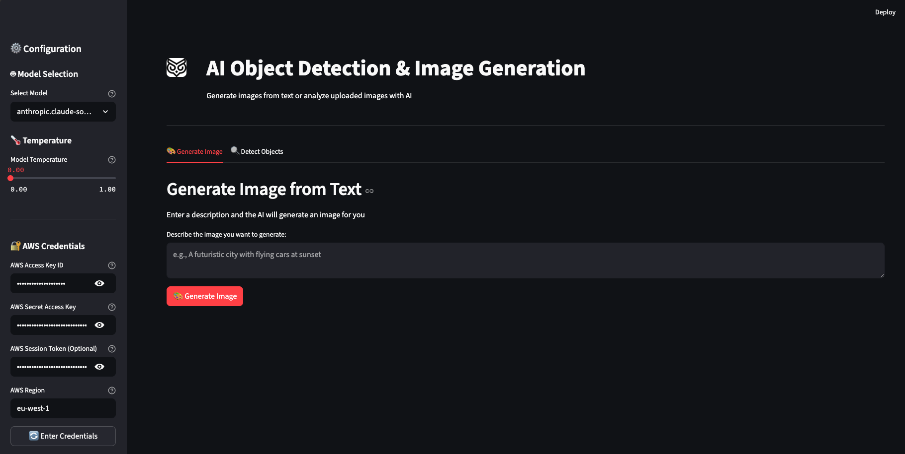

# AI Object Detection & Image Generation 👁️

> ⚠️ **Project Status**: This project is currently under active development and is not yet complete. Features and functionality are being continuously added and improved.

An intelligent AI-powered application that combines image generation and object detection capabilities using AWS Bedrock models and Model Context Protocol (MCP). Generate images from text descriptions or upload images for AI-powered analysis and object detection.



## 🚀 Features

- **🎨 Image Generation**: Create images from text descriptions using state-of-the-art AI models
- **🔍 Object Detection**: Upload images and get detailed AI-powered analysis of detected objects
- **🤖 Multiple AI Models**: Support for various Bedrock models including:
  - Claude 3 Haiku
  - Claude Sonnet 4.5
  - Llama 3.2
- **🌡️ Temperature Control**: Adjust model creativity and randomness
- **🔐 Secure Credentials**: Store and manage AWS credentials safely
- **📊 Interactive UI**: Clean, intuitive Streamlit-based interface

## 📋 Prerequisites

- Python 3.8+
- AWS Account with Bedrock access
- AWS credentials (Access Key, Secret Key, Session Token)

## 🛠️ Installation

1. **Clone the repository**
   ```bash
   git clone <repository-url>
   cd ai-mcp-pic-obj-detection
   ```

2. **Install dependencies**
   ```bash
   pip install -r requirements.txt
   ```

3. **Set up environment variables** (Optional)
   
   Create a `.env` file in the project root:
   ```env
   AWS_ACCESS_KEY_ID=your_access_key
   AWS_SECRET_ACCESS_KEY=your_secret_key
   AWS_SESSION_TOKEN=your_session_token
   AWS_REGION=eu-west-1
   ```

## 🚀 Usage

### Run the Streamlit Application

```bash
streamlit run main.py
```

The application will open in your default browser at `http://localhost:8501`

### Using the Application

1. **Configure Settings**:
   - Select your preferred AI model from the sidebar
   - Adjust temperature for creativity control
   - Enter AWS credentials (or load from saved config)

2. **Generate Images**:
   - Navigate to the "🎨 Generate Image" tab
   - Enter a detailed description of the image you want
   - Click "Generate Image"

3. **Detect Objects**:
   - Navigate to the "🔍 Detect Objects" tab
   - Upload an image (PNG, JPG, JPEG, WEBP)
   - Add optional analysis instructions
   - Click "Analyze Image"

## 📁 Project Structure

```
ai-mcp-pic-obj-detection/
├── main.py                 # Main Streamlit application
├── requirements.txt        # Project dependencies
├── .env                    # Environment variables (create this)
├── .config                 # Stored AWS credentials (auto-generated)
├── logo/                   # Application logos
│   └── 01.png
├── pics/                   # Screenshots and sample images
├── mcp_server/             # MCP server implementation
│   ├── client.py
│   └── memory/
│       ├── long.py
│       └── short.py
├── models/                 # AI model implementations
│   └── bedrock_model.py
├── prompts/                # Prompt management
│   └── prompt.py
└── tools/                  # Utility tools
    └── graphdb_tool.py
```

## 🔧 Configuration

### Available Models

| Display Name | Model ID |
|-------------|----------|
| Claude 3 Haiku | `anthropic.claude-3-haiku-20240307-v1:0` |
| Llama 3.2 3B | `meta.llama3-2-3b-instruct-v1:0` |
| Claude Sonnet 4.5 | `eu.anthropic.claude-sonnet-4-5-20250929-v1:0` |

### AWS Configuration

- **Region**: Default is `eu-west-1` (configurable)
- **Credentials**: Can be provided via:
  - Sidebar input fields
  - `.env` file
  - `.config` file (auto-generated when saved)

## 🧪 Development

### Command-Line Testing

The application includes a commented-out CLI interface for testing:

```python
# Uncomment in main.py to use
if __name__ == "__main__":
    # CLI testing code...
```

## 🛣️ Roadmap

- [ ] Complete object detection implementation
- [ ] Add image-to-image transformation
- [ ] Implement batch processing
- [ ] Add export/download functionality
- [ ] Enhance error handling
- [ ] Add more AI models
- [ ] Implement caching for faster responses
- [ ] Add user authentication

## 🤝 Contributing

As this project is still under development, contributions are welcome! Feel free to:

- Report bugs
- Suggest new features
- Submit pull requests

## 📝 License

[]

## 👤 Author

[Ehsan Tafehi]

## 🙏 Acknowledgments

- AWS Bedrock for AI models
- Streamlit for the web framework
- LangChain for orchestration
- Model Context Protocol (MCP) for integration

---

**Note**: This project is actively being developed. Features and documentation will be updated regularly.
